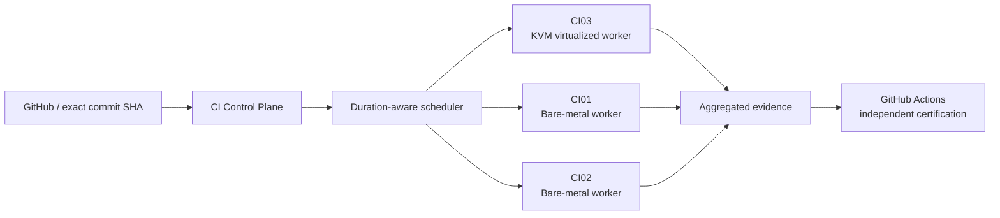

<h1 align="center">Leonardo Escossio</h1>

  <strong>Telecommunications & Network Engineering · SRE · Observability · Distributed Systems · Agentic AI</strong>

  I build systems that turn network, operational and conversational context into controlled, observable action.

---

## About

I have **16+ years of experience across telecom, networking, infrastructure and operations**. Today I work at the intersection of networks and software: routing intelligence, observability, automation, distributed systems and controlled autonomous agents.

My projects are usually built around the same idea: **make complex systems observable, auditable and safe to change**.

## Selected engineering

| Project | What it is | Core areas |
| --- | --- | --- |
| **[Attention Router / Andy](https://github.com/escossio/attention-router)** | Contextual agent runtime with policy-aware autonomy, human control, memory, voice, versioned SDKs and auditable delivery boundaries. | Python · FastAPI · PostgreSQL · Docker · Agentic AI |
| **[RouteBrain](https://github.com/escossio/routebrain)** | Demand-driven network intelligence and routing observability prototype. Its first experiment processed **more than one million real BGP records** from RouteViews. | BGP · RouteViews/MRT · PostgreSQL · FastAPI · Network observability |
| **[REGEN Protocol](https://github.com/escossio/regen-protocol)** | Stateless protocol for regenerative incident reasoning with structured decisions and a hard separation between reasoning, authorization and execution. | Python · Structured contracts · Policy guards · Incident reasoning |
| **[Observabilidade](https://github.com/escossio/observabilidade)** | Reproducible monitoring stack with Zabbix as the collection/alerting backend and Grafana as the operational visualization layer. | Zabbix · Grafana · Linux · HTTP/DNS · Automation |
| **[Andy Android](https://github.com/escossio/andy-android)** | Native Android client for Andy, built around versioned Client API / SDK boundaries and explicit identity/authentication flows. | Kotlin · Android · SDK/API contracts · Identity |
| **[TCP Brain](https://github.com/escossio/tcp-brain)** | TCP intelligence layer that consolidates detector output, exposes an HTTP API and serves an operational dashboard. | Python · FastAPI · Linux · Observability · Production operations |

## Distributed CI & reliability engineering

I also build the infrastructure around the software. For Attention Router, I designed a **heterogeneous distributed CI control plane** that profiles real test duration and schedules work according to measured worker capacity instead of splitting jobs evenly.

On the measured PostgreSQL integration suite, the scheduler distributed **403 tests across 41 files** and brought worker wall time from **286 s to 99 s**. The complete control-plane invocation finished in about **103 s** — roughly **64% less elapsed time / 2.78× faster** than the initial single-worker baseline.

The design uses exact-SHA execution, disposable worktrees, synthetic PostgreSQL instances, persistent dependency caches, automatic re-profiling and a fail-closed rule when the test-file set changes. GitHub-hosted CI remains an independent final certification boundary.

Architecture and benchmark evidence: **[Attention Router distributed CI lab](https://github.com/escossio/attention-router/tree/main/ops/provisioning/distributed-ci-lab)**.

## Tools & technologies

  
  
  
  
  
  
  
  
  
  

## Engineering principles

- **Evidence before automation.** Runtime truth, reproducible checks and explicit failure modes matter more than optimistic assumptions.
- **Trust boundaries are part of the architecture.** Reasoning, authorization and execution should not silently collapse into one layer.
- **Observability is product behavior.** Health, state, delivery evidence and operational history must be inspectable.
- **Changes should preserve what already works.** Validate the delta, look for regressions and keep rollback paths clear.

## GitHub activity

  
  

---

  Networks taught me that the interesting failures are rarely inside a single box.

